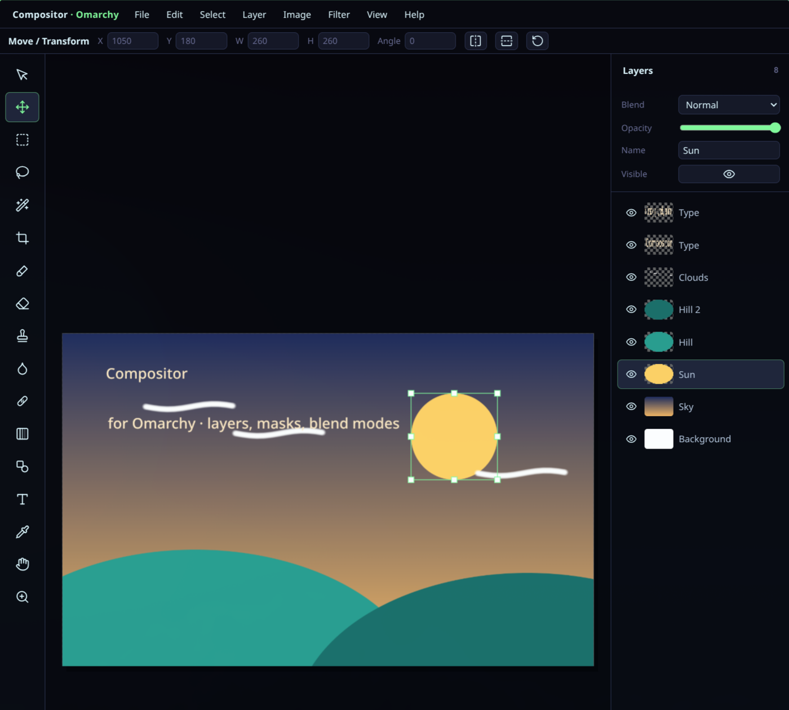
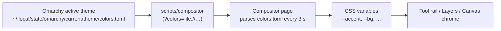

# Compositor for Omarchy

A Photoshop-style image editor for **Arch Linux + [Omarchy](https://omarchy.org)**: layers, folders, masks, blend modes, adjustment layers, selections with marching ants, type on the canvas, free transform, and the Photoshop tools and shortcuts you already know. It follows your Omarchy theme live and opens as an app window like Omarchy's other web apps.



It is a Linux rebuild of **[Compositor for macOS](https://robbietilton.com/compositor)** by **Robbie Tilton** (Wonder Assembly LLC), and shares its `.comp` project format, so files move between the two.

## Install

On Omarchy / Arch, from the AUR (once published):

```bash
omarchy pkg add compositor-for-omarchy
```

From a release tarball (no Node needed):

```bash
curl -LO https://github.com/rubengarciajr/compositor-for-omarchy/releases/download/linux-v1.1.0/compositor-for-omarchy-1.1.0.tar.gz
tar xf compositor-for-omarchy-1.1.0.tar.gz && cd compositor-for-omarchy-1.1.0 && sudo install -Dm755 bin/compositor /usr/bin/compositor && sudo cp -r dist /usr/share/compositor/ && sudo install -Dm644 share/compositor.desktop /usr/share/applications/compositor.desktop
```

From source (this folder): `scripts/install.sh` builds, runs the self-test and installs the package with `makepkg`.

Then launch **Compositor for Omarchy** from the app menu, or `compositor photo.png` from a terminal. It needs a Chromium-based browser to draw its window (open-source `chromium` is preferred; see Requirements).

The app is about 200 KB installed. `compositor --cache` shows the private browser profile it runs in and `compositor --clean` resets it.

## Credits

- **Original app:** [Compositor for macOS](https://robbietilton.com/compositor) by [Robbie Tilton](https://github.com/robbietilton) — Wonder Assembly LLC, MIT. Source: [github.com/robbietilton/Compositor](https://github.com/robbietilton/Compositor).
- **Linux port:** this `linux/` folder, MIT. Help › About in the app carries the same credit.
- **Omarchy** by DHH and contributors provides the theme palette and the desktop conventions the port follows.

---

## For developers

**What's different on Omarchy:** see [`docs/omarchy-upgrades.md`](../docs/omarchy-upgrades.md) for the full list of upgrades, and [`docs/linux-changelog.md`](../docs/linux-changelog.md) for the versioned changelog.



## Features

- **Layers** — raster, folders (nested, fold/unfold, drag into), opacity, all Photoshop blend modes, visibility, reorder, rename, duplicate, merge down, flatten; right-click for the layer menu (Group, Ungroup, Duplicate, Delete, …); Ctrl-click / Shift-click multi-select
- **Masks & effects** — layer mask, drop shadow, outer glow, stroke, color overlay, inner shadow
- **Adjustment layers** — Hue/Saturation, Levels, Curves, Exposure, Gradient Map, Grain, Noise, Invert, B&W, Color Balance, Gaussian Blur, Motion Blur (each affects everything below it in the stack)
- **Type** — type directly on the canvas (click to place, click existing text to edit), font family (installed system fonts on request), weight, size, colour, alignment, leading and tracking
- **Transform** — handles around the selected layer with the Move tool: scale (proportional, Shift free, Alt from centre), rotate by dragging outside a corner, numeric X/Y/W/H/Angle, flips, reset
- **Tools** — Move, Marquee (rect/ellipse), Lasso (free/polygon), Magic Wand, Crop, Brush, Eraser, Clone Stamp, Blur, Spot Healing, Gradient, Shape, Type, Eyedropper, Hand, Zoom — with Photoshop's modifiers (Space pans, Shift-click lines, Alt samples, Shift/Alt constrain or draw from the centre, Ctrl-click auto-select, Alt-drag duplicate)
- **Add Image** — Layer › Add Image… (or the picture button under the layer list) brings image files in as new layers fitted inside the canvas
- **Gradient** — Photoshop "Basics" presets (Foreground to Background, Foreground to Transparent, Background to Transparent, Black/White), linear or radial, reverse; painted along the drag on its own new layer, limited to the selection when there is one
- **Selections** — mask-based with marching ants; Magic Wand, Marquee and Lasso add with `Shift` and subtract with `Alt` (cursor shows + / −); right-click a selection for Layer via Copy / Cut, Layer Mask from Selection, Inverse, Deselect, Fill, Clear; Select menu with `Ctrl+A` / `Ctrl+D` / `Ctrl+Shift+I` / `Ctrl+J` / `Ctrl+Shift+J`
- **Canvas** — pixel grid when zoomed, guides, pan/zoom, fit on screen, several documents open at once (switch in the status bar)
- **Files** — `.comp` projects (Save / Save As / Open, native dialogs) that keep every layer editable and unzip into the macOS app's package format; open images by drag & drop, File → Open, or on the command line; export PNG / JPEG
- **Clipboard** — paste images from anywhere as a new layer (`Ctrl+V`); Copy / Copy Merged put PNG on the system clipboard, limited to the selection
- **Omarchy theming** — live `colors.toml` sync, light and dark palettes, accent + surface tokens

## Stack

| Layer | Choice |
| --- | --- |
| UI | TypeScript + Vite (zero framework) |
| Raster | Canvas 2D; GPU blend modes where Canvas has them, ImageData math for the rest |
| Theme | Omarchy `colors.toml` → CSS variables |
| Shell | Chromium `--app` window with its own profile |
| Package | `PKGBUILD` + `.desktop` |

## Requirements

- A **Chromium-based browser** to draw the window. The launcher prefers open-source `chromium` (no Google services), then your default browser if it is Chromium-based, then anything Chromium-based it can find (Chrome, Brave, Edge, Vivaldi, Helium, Thorium, the Chromium / Brave / Chrome Flatpaks). Set `COMPOSITOR_BROWSER=brave` to force one; `compositor --browser` shows the choice. With none installed it prints and notifies `omarchy pkg add chromium`. Firefox cannot host the app window.
- Node.js + npm to build.

## Quick start (dev)

```bash
cd linux
npm install
npm run theme          # copy the active Omarchy palette into public/ (no-op off Omarchy)
npm run dev            # http://localhost:5173
```

`npm run theme -- --theme gruvbox` pulls a specific theme; `node scripts/sync-omarchy-theme.mjs --watch` keeps `public/` in sync while you switch themes with Super + Ctrl + Shift + Space.

### Before shipping a change

```bash
npm run check          # typecheck + build + headless self-test in Chromium
```

`npm test` alone re-runs the self-test against the current `dist/`. It boots the built app with `?selftest=1` and checks compositing (groups, masks, adjustments, effects, blend modes), text layout, clipboard paste/copy, undo/redo, merge and theme parsing. Add a check to `src/selftest.ts` whenever you add a feature. What changed in each update is tracked in [`docs/linux-changelog.md`](../docs/linux-changelog.md).

## Run like a desktop app on Omarchy

```bash
cd linux
npm install
npm run build
./scripts/compositor
./scripts/compositor photo.png            # open files
./scripts/compositor --theme catppuccin   # force a palette (any Omarchy theme name, or dark / light)
```

`scripts/compositor` opens the built app as a Chromium app window and points it at the live Omarchy palette, so switching themes in Omarchy restyles the editor within a few seconds — no sync step, no background process.

### Smooth rendering under Hyprland

Omarchy gives every window slight translucency plus background blur, which makes Hyprland re-blur the whole editor on each repaint while you drag a slider. Keep Compositor opaque like Omarchy does for its own colour-critical apps — add to `~/.config/hypr/hyprland.lua`:

```lua
o.window("^chrome-__usr_share_compositor_dist_index.html-Default$", { tag = "-default-opacity", opacity = "1 1", no_blur = true })
```

(then `hyprctl reload`). The class above is what Chromium reports for the packaged install; `hyprctl clients` shows it.

### Keeping the app light

The app itself is about 200 KB installed; the browser profile it runs in is what can grow. The launcher keeps it small:

- the profile is started with extensions, component downloads, ML model downloads, Safe Browsing databases, sync, translation, crash upload and background fetches switched off, and a 64 MB disk cache;
- at every launch it deletes what a browser may still have dropped there (model stores, component caches, speech engines, extension copies);
- `compositor --cache` shows what the profile holds, `compositor --clean` deletes it (it is recreated on the next launch), and `COMPOSITOR_PROFILE=/path` uses a different one.

Nothing of yours lives in that profile: documents are files you save, and preferences (theme, gradient) are tiny entries in its local storage.

### Why the launcher uses a private browser profile

Chromium treats every `file://` page as its own origin: it refuses to load the app's own module script and stylesheet, blocks `fetch()` of `colors.toml`, and "taints" any canvas that drew an image opened by path so pixels can no longer be read back. `--allow-file-access-from-files` lifts those restrictions, but Chromium ignores flags handed to an already-running instance, so the app runs in its own profile at `~/.local/state/compositor/browser-profile`. Only Compositor's own files are ever loaded there.

## Install on Arch / Omarchy

Recommended — one command that typechecks, builds, runs the headless self-test and only then packages and installs (asks for your password for pacman):

```bash
linux/scripts/install.sh
```

Re-run it after every change; it is the update path too. Or by hand:

```bash
cd linux/packaging
makepkg -si
```

That installs:

- `/usr/share/compositor/dist` — built app
- `/usr/bin/compositor` — launcher
- `/usr/share/applications/compositor.desktop` — app menu entry (Super + Space), with PNG/JPEG/WebP/GIF/BMP/AVIF/SVG associations
- `/usr/share/icons/hicolor/scalable/apps/compositor.svg`

## Making a release

`scripts/release.sh` runs the checks, builds, and writes `release/compositor-for-omarchy-<version>.tar.gz` (prebuilt `dist/`, launcher, desktop entry, icons, docs; nothing to compile on the user's machine) plus `release/PKGBUILD` with the tarball URL and sha256 filled in. Bump `version` in `package.json` and `pkgver` in `packaging/PKGBUILD`, add the changelog entry, run the script, tag `linux-v<version>`, upload the tarball to the GitHub release and push `release/PKGBUILD` to the AUR. The project URLs live in `src/app-info.ts` (Help › About, Report a Bug) and in `packaging/PKGBUILD.release`.

## Keyboard shortcuts

Tools follow Photoshop: `V M L W C B E S R G U T I H Z`, `X` swaps foreground/background, `D` resets them to black/white, `[` / `]` brush size, `Shift+[` / `]` hardness, arrows nudge (Shift for ×10), `Backspace` clears, `Alt+Backspace` fills with the foreground colour. Paint tools show a circle the size of the brush instead of an arrow.

| Action | Linux | macOS label |
| --- | --- | --- |
| Undo / Redo | `Ctrl+Z` / `Ctrl+Shift+Z` | ⌘Z / ⇧⌘Z |
| New canvas | `Ctrl+N` | ⌘N |
| Open image | `Ctrl+O` | ⌘O |
| Save / Save As | `Ctrl+S` / `Ctrl+Shift+S` | ⌘S / ⇧⌘S |
| Export PNG / JPEG | `Ctrl+Shift+E` / `Ctrl+Alt+Shift+S` | ⇧⌘E / ⌥⇧⌘S |
| Close document / Quit | `Ctrl+W` / `Ctrl+Q` | ⌘W / ⌘Q |
| New blank layer | `Ctrl+Shift+N` (or `Ctrl+Alt+L`) | ⇧⌘N |
| Duplicate layer / Group / Merge down | `Ctrl+J` / `Ctrl+G` / `Ctrl+E` | ⌘J / ⌘G / ⌘E |
| Copy / Copy Merged / Paste as layer | `Ctrl+C` / `Ctrl+Shift+C` / `Ctrl+V` | ⌘C / ⇧⌘C / ⌘V |
| Invert pixels | `Ctrl+I` | ⌘I |
| Free Transform (Move tool with handles) | `Ctrl+T` | ⌘T |
| Fit on screen / 100 % | `Ctrl+0` / `Ctrl+1` | ⌘0 / ⌘1 |
| Zoom / pan | `Ctrl+wheel` / wheel, or `Alt+drag` with Move | |

Transform controls are always shown for the selected layer while the Move tool is active (Photoshop's "Show Transform Controls"), so there is no modal transform to enter: drag a handle to scale, drag just outside a corner to rotate, Shift/Alt modify, and the tool header takes exact values.

Closing: `Ctrl+W` closes the document and `Ctrl+Q` quits, each through the app's own Save / Don't Save / Cancel dialog. Closing the window from Hyprland (Super+W) cannot be intercepted, so Chromium's own "Leave app?" prompt appears there if work is unsaved.

## How Omarchy theming works

1. Omarchy keeps the active palette in `~/.local/state/omarchy/current/theme/colors.toml` (the theme name is in `…/current/theme.name`). Themes themselves live in `~/.config/omarchy/themes/<name>/` and `/usr/share/omarchy/themes/<name>/`.
2. The launcher passes that path to the page as `?colors=file://…`; `--theme <name>` points at a theme's own `colors.toml` instead.
3. `src/theme/omarchy.ts` parses the TOML, maps the tokens onto CSS variables and re-reads the file every 3 seconds, applying it only when it changed.

| colors.toml | UI role |
| --- | --- |
| `background` / `dark_background` / `darker_background` | app / panels / canvas chrome |
| `lighter_background` | raised surfaces, inputs |
| `foreground` (+ dark/light/bright) | text hierarchy |
| `accent` | selection, focus, primary actions |
| `selection` / `muted` | hover, borders |
| `mode` | light or dark chrome (`color-scheme`) |
| `red` … `bright_magenta` | semantic / status accents |

View › Theme offers Omarchy (follow the desktop, default), Dark and Light; the choice is remembered. Palette resolution: View › Theme choice or `?theme=dark|light` → `?colors=` (live Omarchy palette) → `./omarchy-theme.json` (dev) → `./colors.toml` → built-in Dark.

## Repo layout

```
linux/
  src/
    core/       document model, history, pixel ops
    render/     compositor / viewport
    theme/      Omarchy colors.toml bridge
    ui/         Photoshop-style shell
    styles.css
  scripts/
    compositor              launcher
    sync-omarchy-theme.mjs  colors.toml → public/ (dev server only)
  packaging/
    PKGBUILD
    compositor.desktop
```

## Project files

`File › Save` writes a `.comp`: a ZIP containing `manifest.json` and `images/<LAYER UUID>.png` (masks as `<UUID>.mask.png`), the same layout the macOS app stores as a document package (format version 9, [`docs/project-format.md`](../docs/project-format.md)). Unzip a Linux `.comp` and you have a Mac package; zip a Mac package and Linux opens it. Everything editable is kept: folders, masks, clipping masks, transforms, blend modes, effects, text styling, shapes, adjustment layers and guides. Linux-only details (font weight, adjustment parameters, folder state) sit under `linux` keys that other readers ignore. Undo history, selection and view are session-only, as on the Mac. PSD import/export is the next step once sample files are available.

## Known limitations

- Adjustment layers and effects have no parameter editor yet; they are added with sensible defaults (edit them in code or wait for the inspector).
- Undo history is one stack shared by all open documents; switching documents starts it afresh. Every step stores a full copy of each layer, so very large documents use a lot of memory.
- The Blur tool is a soft-retouch approximation, not a true local blur; Clone Stamp samples the flattened image.
- Import is limited to what Chromium can decode (no HEIC, TIFF or PSD).

## macOS original

The upstream Swift/SwiftUI + Metal app remains in `Compositor/` (see the root `README.md`). This Linux tree is a parallel implementation of that product's workflow, not a source-level port of the Metal renderer.

## License

MIT — see `LICENSE` in the repository root.

## Performance notes

- History is copy-on-write: entries share layer bitmaps with the document and a bitmap is copied only when a tool draws into it, so undo/redo and commits cost about a millisecond even on large documents.
- Brush strokes composite incrementally: the layers below and above the painted one are cached for the duration of the stroke, so a frame is three draws regardless of layer count (falls back automatically when an adjustment, clipping layer or blend mode above depends on the painted pixels).
- Flattening uses native Canvas 2D blend operations wherever Chromium supports them and caches the result per document version.
